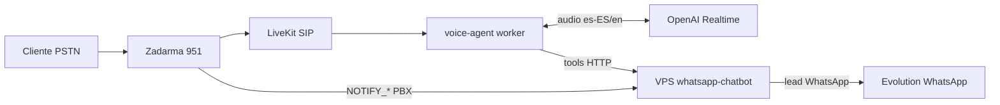

# Agente de voz Roberto (Zadarma + OpenAI Realtime)

Roberto es el recepcionista telefónico de Inmobiliaria Bazán para el **+34 951 870 058**
(Zadarma). Atiende llamadas de voz en tiempo real, clasifica la intención del cliente, consulta
las fichas reales de la web, avisa por WhatsApp al comercial encargado y guarda el histórico de
cada llamada (transcripción y, opcionalmente, audio). Reutiliza la misma lógica comercial que el
WhatsApp-chatbot, así que las reglas de leads son idénticas en ambos canales.

## Arquitectura



- **Motor de voz:** OpenAI Realtime API (speech-to-speech), voz castiza (`marin` por defecto).
- **Puente SIP:** LiveKit recibe las llamadas de Zadarma y lanza el worker `voice-agent/`.
- **Cerebro de negocio:** vive en el VPS. El worker solo orquesta audio y llama a las tools HTTP;
  los precios y fichas nunca se inventan, siempre salen de `buscar_propiedad`.
- **Disponibilidad:** 24/7 (`VOICE_ROBERTO_ALWAYS_ON=1`), a diferencia del bloqueo horario de Leo
  en WhatsApp.

## Componentes

| Componente | Ubicación |
|------------|-----------|
| Prompt de Roberto (versionado) | `src/voice/robertoPrompt.ts` |
| Handlers de tools | `src/voice/realtimeTools.ts` |
| Persistencia de llamadas | `src/voice/voiceCallStore.ts` (tablas `voice_calls`, `voice_call_turns`) |
| Rutas HTTP del agente | `src/voice/voiceRoutes.ts` |
| Correlación PBX | `src/voice/zadarmaWebhook.ts` |
| Admin/revisión | `GET /admin/voice/calls` en `src/admin/routes.ts` |
| Worker de audio | `voice-agent/` (Python, LiveKit Agents) |
| Purga por retención | `npm run voice:purge` (`src/voice/purgeCli.ts`) |

## Rutas del backend (VPS)

Todas bajo `X-Voice-Api-Key: <VOICE_API_KEY>`.

| Método y ruta | Uso |
|---------------|-----|
| `GET /voice/roberto/instructions` | Prompt + saludo versionados que carga el worker por llamada |
| `POST /voice/sessions/start` | Abre la llamada (`caller`, `called_did`, `pbx_call_id`) → `callId` |
| `POST /voice/sessions/:id/turn` | Guarda un turno transcrito (`role`, `text`) |
| `POST /voice/sessions/:id/end` | Cierra la llamada (`summary`, `intent`, `disposition`, `audio_path`) |
| `POST /voice/tools/buscar-propiedad` | Busca fichas en SQLite (nunca inventa) |
| `POST /voice/tools/derivar-comercial` | Avisa al comercial por WhatsApp (mismo formato que chat) |
| `POST /voice/tools/enviar-whatsapp` | Envía al cliente la ficha o un texto por WhatsApp |

Admin (con `x-admin-key`):

- `GET /admin/voice/calls?limit=50&offset=0` — listado de llamadas.
- `GET /admin/voice/calls/:id` — detalle + transcripción por turnos.

## Reglas de leads (paridad con WhatsApp)

- Compra / alquiler / visita → comercial de compradores (`VOICE_BUYER_AGENT_*`, por defecto Miguel).
- Venta / alquiler de propietario / traspaso → comercial de propietarios (`VOICE_OWNER_AGENT_*`,
  por defecto Álvaro).
- Si la ficha tiene comercial asignado (scrape), ese prevalece sobre el valor por defecto.
- Deduplicación: no se reavisa por el mismo contacto/ref en 7 días (`hasRecentLeadNotification`).
- Alquiler: se informa de la regla de ingresos ≥ 2× la renta; no se prometen condiciones fuera
  de la ficha.

## Configuración

### Backend (`.env` del VPS)

```bash
VOICE_ROBERTO_ENABLED=1
VOICE_ROBERTO_ALWAYS_ON=1
VOICE_API_KEY=<clave-compartida-con-el-worker>
VOICE_BUYER_AGENT_NAME=Miguel
VOICE_BUYER_AGENT_PHONE=34620555989
VOICE_OWNER_AGENT_NAME=Álvaro
VOICE_OWNER_AGENT_PHONE=34646424563
VOICE_RECORDINGS_DIR=./data/voice-recordings
VOICE_RETENTION_DAYS=90
# Reutiliza EVOLUTION_INSTANCE para el envío de WhatsApp desde voz.
```

### Worker (`voice-agent/.env`)

Ver `voice-agent/.env.example`: `LIVEKIT_URL`, `LIVEKIT_API_KEY`, `LIVEKIT_API_SECRET`,
`OPENAI_API_KEY`, `OPENAI_REALTIME_MODEL`, `OPENAI_REALTIME_VOICE`, `VPS_BASE_URL`,
`VOICE_API_KEY`, `VOICE_RECORDING_ENABLED`, `VOICE_RECORDINGS_DIR`.

## Puesta en marcha

1. **Backend:** poner las variables anteriores, `npm run build`, reiniciar el servicio. Al arrancar
   debe verse `[voice] Agente Roberto activo`.
2. **LiveKit:** crear un *SIP inbound trunk* y una *dispatch rule* hacia una room.
3. **Zadarma:** enrutar el 951 al servidor SIP externo de LiveKit **las 24 horas** y configurar el
   webhook PBX a `https://<vps>/webhook/zadarma` (ver `docs/ZADARMA.md`).
4. **Worker:** desplegar `voice-agent/` (Docker o systemd) con `python agent.py start`.
5. **Prueba end-to-end:** llamar al 951, confirmar saludo de Roberto, que responde solo con datos
   de fichas reales, deriva al comercial y guarda la llamada en `GET /admin/voice/calls`.

## Grabación y mejora continua

- Con `VOICE_RECORDING_ENABLED=1` el worker inicia un egress de audio de LiveKit a
  `VOICE_RECORDINGS_DIR/{call_id}.ogg` y guarda la ruta en `voice_calls.audio_path`.
- La transcripción se persiste por turnos (`voice_call_turns`) según los eventos de conversación.
- Retención: `npm run voice:purge` (programar por cron) borra llamadas y audios más antiguos que
  `VOICE_RETENTION_DAYS`.

## Voz española e inglés

Las instrucciones fuerzan español de España (no latino) y cambio automático a inglés si el cliente
habla en inglés. Si la voz Realtime no convence en es-ES, probar otras (`cedar`, `alloy`) o, como
fase 2, una cascada Realtime→texto + TTS Piper `es_ES-*` sin tocar el cerebro.
